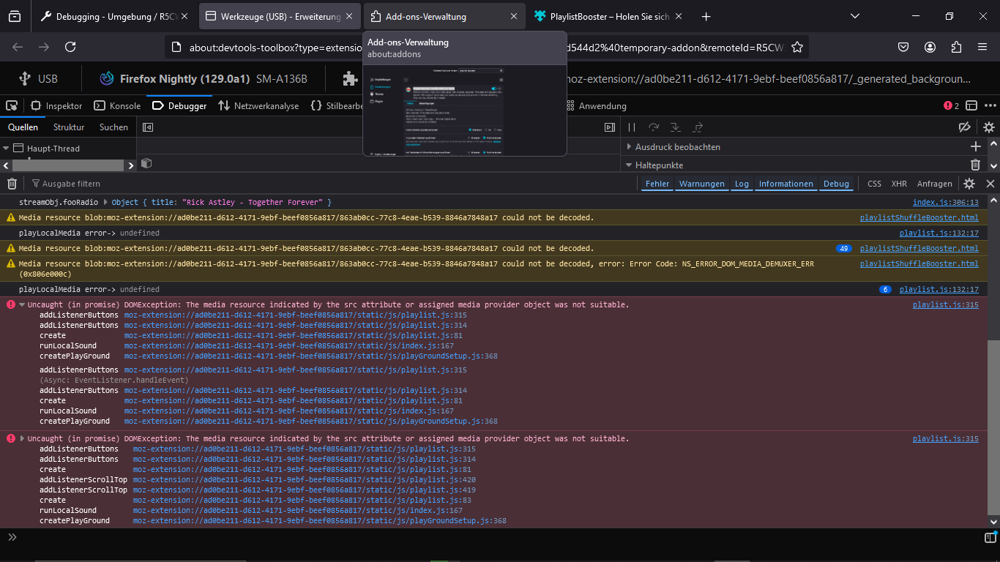

Bug 1903558
======================================

Overview
---------
This repository is used to reproduce a FF bug.

Fenix and Nigtly suffer from lost file handle <fileUpload.files> if tab goes background

* Android FF <input type="file", loaded audio and video media
* if tab goes background play stops, wikipedia in forground
* if tab comes in front play() refuses (other add-on also refuses to load next file, full red error)
* Android Studio Emulator AVD 13.5  Freeform API 30 and Samsung A136B 

Same error number as here https://bugzilla.mozilla.org/show_bug.cgi?id=1417113 , but not related.
Use same method to load media files in audio/video element. Build a minimal extension from it.

Full error
-------------
See full error with: https://addons.mozilla.org/en-US/firefox/addon/playlistbooster/

A more detailed message of the bug on screen shot.

If the media stuck and the next media is selected (ffw btn) the console logs the 'resource not suitable'.

File handles are gone.

-

HowTo Android
--------------
Clone the repo. 

Install 'web-ext' "https://extensionworkshop.com/documentation/develop/developing-extensions-for-firefox-for-android/".

Install Android Studio latest and create a dummy project. The device manager is needed to run a Android Virtual Device (AVD).

You then want to download the FireFox apk file and drag it onto the AVD. 
Search "Firefox Nightly for Developers". If you find 'APKmirror' save, go there. Else use the registration
process to enable PlayStore to pull FireFox Nightly, into every AVD.

.. note::
    Deinstall FireFox 'regular' version, if any.

Open a terminal in the root of the repo clone, to load the Add-on into the AVD via USB.

.. code-block:: console

    @PlaylistBooster$ adb devices -l
    List of devices attached
    emulator-5554   offline

    @PlaylistBooster$ web-ext run --target=firefox-android --android-device emulator-5554 --firefox-apk org.mozilla.fenix

The AVD and FireFox Nightly must be USB enabled (Dev mode) then.

Drag some media files into 'Device Explorer' in 'Android Studio'. Use 'mnt/sdcard/Music', to see it in user view on AVD.

Connect FF Nightly remote debugger to the Android device Add-on. Both FF Nightly must be of same version.

FireFox for Android looses file collection object  
^^^^^^^^^^^^^^^^^^^^^^^^^^^^^^^^^^^^^^^^^^^^^^^^^^
(A) FF video element 
will stop playing at all, if the PlaylistBooster tab is in the 
background and you want to bring it to the foreground.

(B) FF video element
will stop playing if the PlaylistBooster tab is in the 
background and you open another website.

Temporary solution: Press app reload button.

FireFox for Android Add-on not visible (DEV)  
^^^^^^^^^^^^^^^^^^^^^^^^^^^^^^^^^^^^^^^^^^^^^
FireFox Nightly MUST have an open tab (i.e wikipedia) 
before you can see/click the ( <temporay> web-ext ) Add-on in the Extension bar.
